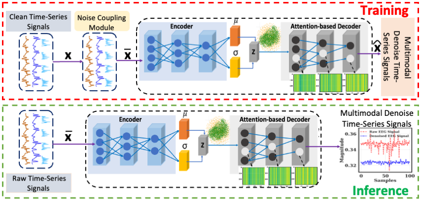
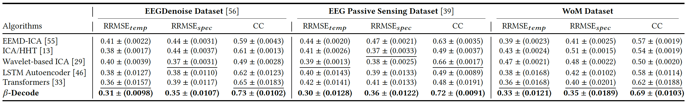

# Beta-Decode: In 8th International Confernce on Data Science and Management of Data (12th ACM IKDD CODS and 30th COMAD) (CODS-COMAD Dec ’24), December 18–21, 2024, Jodhpur, India.

Official Implementation for "𝛽-Decode: Attention-based Decoding Temporal Artifacts via Unsupervised 𝛽-Variational Autoencoder"


**Abstract:-** Physiological sensing modalities, such as Electroencephalography (EEG), Galvanic Skin Response (GSR), and Photoplethysmography (PPG), provide detailed representations of cognitive and physiological states, proving invaluable for applications in human-computer interaction and digital health. However, these time-series signals
are frequently affected by stationary and non-stationary noise, temporal fluctuations, and user-specific physiological variations, compromising signal integrity. To address these challenges, we propose 𝛽-Decode, a generative, unsupervised denoising framework tailored for multi-modal time series data. 𝛽-Decode achieves two
main objectives: (i) learning global and local temporal dependencies within time-series representations to enhance denoising and (ii) handling unseen temporal noise variations. 𝛽-Decode leverages a 𝛽-variational autoencoder (𝛽-VAE) combined with an attention mechanism, capturing the data distribution via latent representations. Additionally, we introduce a modal-specific noise-coupling strategy (NCS) to simulate diverse noise patterns, enhancing 𝛽-Decode’s adaptability across datasets.



The architecture of Beta-Decode consists of two main stages: training and inference. The training phase has two modules: a modal-specific noise coupling strategy applied to clean signals, followed by a dot-product attention-based beta-variational autoencoder module to learns the local and global temporal representation of the noisy signals and reconstructs the denoised signals. During inference phase, the trained model is applied to unseen Raw signals to separate noise and reconstruct denoised signals.



Comparison between the state-of-the-art 5 unsupervised denoising algorithms (traditional based: EEMD-ICA, ICA-HHT, and wavelet-based ICA [29] and (ii) deep learning-based: transformers and LSTM autoencoder frameworks) vs 𝛽-Decode across two public (EEG Passive Sensing and EEGdenoiseNet) and our in-house Working Memory (WoM) datasets. The top and 2nd best results are in bold and underlined, respectively. 

# Installation

### Clone the Repository

To get started, clone this repository:

```bash
git clone https://github.com/indrajeetghosh/Beta-Decode.git
cd Beta-Decode
```


### Install Packages

Once inside the repository directory, install the required packages by running:

```bash
pip3 install -r requirements.txt
```

## Contact

If you have any questions, please feel free to reach out via email at [indrajeetghosh@umbc.edu](mailto:indrajeetghosh@umbc.edu).

## Acknowledgements

This work has been partially supported by: *U.S. Army Grant #W911NF2120076*, *NSF CAREER Award #1750936*, *ONR Grant #N00014-23-1-2119*, *NSF REU Site Grant #2050999* and *NSF CNS EAGER Grant #2233879*.

